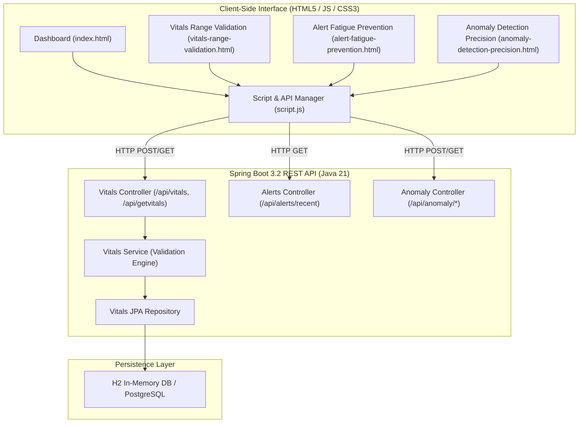

# Healthcare Management Platform for Clinical Operations

A comprehensive, integrated clinical operations and safety validation platform. This application combines a **Spring Boot 3.2 (Java 21)** REST backend with an interactive, responsive frontend for vitals range validation, alert fatigue prevention, and AI anomaly detection precision tracking.

---

## Architecture Overview



---

## Core Features & Workflow

### 1. Vitals Range Validation
- **Clinician Entry**: Clinician inputs Patient ID and 6 vital signs:
  - Heart Rate (bpm)
  - SpO₂ (%)
  - Body Temperature (°C)
  - Respiratory Rate (/min)
  - Systolic BP (mmHg)
  - Diastolic BP (mmHg)
- **Spring Boot Validation Engine**: `VitalsService.java` inspects each parameter against clinical safety thresholds and assigns status tags (`NORMAL`, `LOW`, `HIGH`).
- **JPA Persistence**: Automatically attaches a timestamp (`recordedAt` / `recorded_at`) and saves to the database.
- **Real-Time Display**: Returns saved records to populate the **Current Vitals** visualization gauge and updates the **Patient History** log.

### 2. Alert Fatigue Prevention
- **Noise Reduction**: Categorizes alerts into `HIGH`, `MEDIUM`, and `LOW` severities.
- **Suppression Engine**: Automatically suppresses duplicate pings (within 5-minute windows), repeat vital triggers for the same bed, and low-severity sensor noise.
- **Visual Distinction**: Suppressed pings are dimmed and categorized while active critical alerts stay highlighted.

### 3. Anomaly Detection Precision
- **Multivariate Scoring**: Accepts patient vital metrics and calculates a normalized anomaly score simulating an **Isolation Forest** model.
- **Classification**: Returns `prediction` (`-1` for Anomaly, `1` for Normal) and `anomalyDetected` boolean.
- **Precision Metrics**: Evaluates true positives (TP) and false positives (FP) against an **85% precision floor**.

---

## Clinical Validation Thresholds

| Vital Sign | Normal Range | Low Condition | High Condition |
| :--- | :--- | :--- | :--- |
| **Heart Rate** | `60 – 100 bpm` | `< 60 bpm` | `> 100 bpm` |
| **SpO₂** | `95 – 100 %` | `< 95 %` | N/A |
| **Temperature** | `36.1 – 37.2 °C` | `< 36.1 °C` | `> 37.2 °C` |
| **Respiratory Rate** | `12 – 20 /min` | `< 12 /min` | `> 20 /min` |
| **Systolic BP** | `90 – 120 mmHg` | `< 90 mmHg` | `> 120 mmHg` |
| **Diastolic BP** | `60 – 80 mmHg` | `< 60 mmHg` | `> 80 mmHg` |

---

## API Reference

Base URL: `http://localhost:8080`

### 1. Validate & Save Vitals
- **Endpoint**: `POST /api/vitals`
- **Headers**: `Content-Type: application/json`
- **Request Body**:
```json
{
  "patientId": "P1001",
  "heartRate": 78.0,
  "spo2": 98.0,
  "temperature": 36.8,
  "respiratoryRate": 16.0,
  "systolicBp": 120.0,
  "diastolicBp": 80.0
}
```
- **Response** (`200 OK`):
```json
{
  "id": 1,
  "patientId": "P1001",
  "heartRate": 78.0,
  "heartRateStatus": "NORMAL",
  "spo2": 98.0,
  "spo2Status": "NORMAL",
  "temperature": 36.8,
  "temperatureStatus": "NORMAL",
  "respiratoryRate": 16.0,
  "respiratoryRateStatus": "NORMAL",
  "systolicBp": 120.0,
  "diastolicBp": 80.0,
  "bloodpressureStatus": "NORMAL",
  "recordedAt": "2026-08-27T11:55:15.955Z"
}
```

### 2. Fetch Stored Vitals History
- **Endpoint**: `GET /api/getvitals`
- **Response** (`200 OK`):
```json
[
  {
    "id": 1,
    "patientId": "P1001",
    "heartRate": 78.0,
    "heartRateStatus": "NORMAL",
    "spo2": 98.0,
    "spo2Status": "NORMAL",
    "temperature": 36.8,
    "temperatureStatus": "NORMAL",
    "respiratoryRate": 16.0,
    "respiratoryRateStatus": "NORMAL",
    "systolicBp": 120.0,
    "diastolicBp": 80.0,
    "bloodpressureStatus": "NORMAL",
    "recordedAt": "2026-08-27T11:55:15.955Z"
  }
]
```

### 3. Fetch Current Vitals (Dashboard Bootstrap)
- **Endpoint**: `GET /api/vitals/current`
- **Response** (`200 OK`): Array of current vital records.

### 4. Detect Anomaly
- **Endpoint**: `POST /api/anomaly/detect`
- **Request Body**:
```json
{
  "heart_rate": 115.0,
  "systolic_bp": 150.0,
  "diastolic_bp": 95.0,
  "temperature": 38.2,
  "spo2": 91.0,
  "respiratory_rate": 24.0
}
```
- **Response** (`200 OK`):
```json
{
  "status": "SUCCESS",
  "anomalyDetected": true,
  "prediction": -1,
  "anomalyScore": 1.0375
}
```

### 5. Fetch Anomaly Precision Metrics
- **Endpoint**: `GET /api/anomaly/precision`
- **Response** (`200 OK`):
```json
{
  "total": 250,
  "tp": 227,
  "fp": 23,
  "precision": 90.8,
  "metrics": {
    "true_positives": 227,
    "false_positives": 23,
    "precision": 90.8,
    "total": 250
  }
}
```

### 6. Fetch Recent Alerts
- **Endpoint**: `GET /api/alerts/recent`
- **Response** (`200 OK`): List of recent alerts with severity tags and suppression flags.

---

## How to Build & Run

### Prerequisites
- **JDK 21** or higher installed.
- Maven Wrapper is included in the project (`mvnw` / `mvnw.cmd`).

### 1. Run Automated Unit & Integration Tests
Navigate to the `backend` directory and run:
```bash
# Windows
.\mvnw.cmd test

# Linux / macOS
./mvnw test
```
*Runs all 9 tests in `VitalsValidationApplicationTests.java` covering controllers, services, and repository interactions.*

### 2. Start the Spring Boot Backend Server
```bash
# Windows
.\mvnw.cmd spring-boot:run

# Linux / macOS
./mvnw spring-boot:run
```
The server will start on `http://localhost:8080`.
- **H2 Console**: Available at `http://localhost:8080/h2-console` (JDBC URL: `jdbc:h2:mem:medisphere`, User: `sa`, Password: empty).

### 3. Open the Frontend Application
Simply open `index.html` or any module page in a browser:
- `index.html` (Safety Dashboard)
- `vitals-range-validation.html` (Vitals Range Validation)
- `alert-fatigue-prevention.html` (Alert Fatigue Prevention)
- `anomaly-detection-precision.html` (Anomaly Detection Precision)

---

## Project Directory Structure

```
Healthcare_Management_Platform_Integrated/
├── backend/
│   ├── src/
│   │   ├── main/
│   │   │   ├── java/com/springboard/Vitals_validation/
│   │   │   │   ├── controller/
│   │   │   │   │   ├── vitalscontroller.java
│   │   │   │   │   ├── AnomalyController.java
│   │   │   │   │   └── AlertsController.java
│   │   │   │   ├── model/
│   │   │   │   │   └── Vitalsmodel.java
│   │   │   │   ├── service/
│   │   │   │   │   └── VitalsService.java
│   │   │   │   ├── VitalsRepository/
│   │   │   │   │   └── VitalsRepository.java
│   │   │   │   └── VitalsValidationApplication.java
│   │   │   └── resources/
│   │   │       └── application.properties
│   │   └── test/java/com/springboard/Vitals_validation/
│   │       └── VitalsValidationApplicationTests.java
│   ├── pom.xml
│   └── mvnw.cmd
├── index.html
├── vitals-range-validation.html
├── alert-fatigue-prevention.html
├── anomaly-detection-precision.html
├── script.js
├── style.css
├── README.md
└── README_INTEGRATION.md
```
